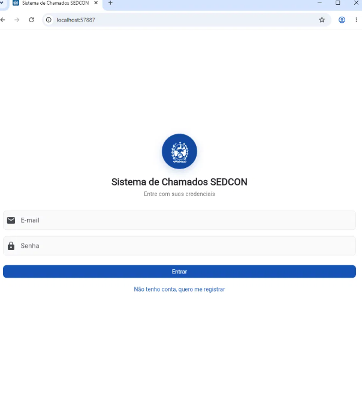
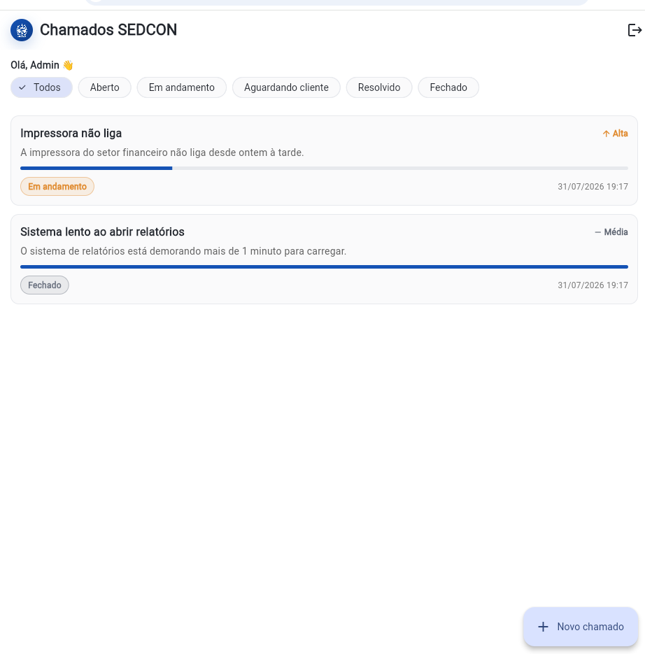
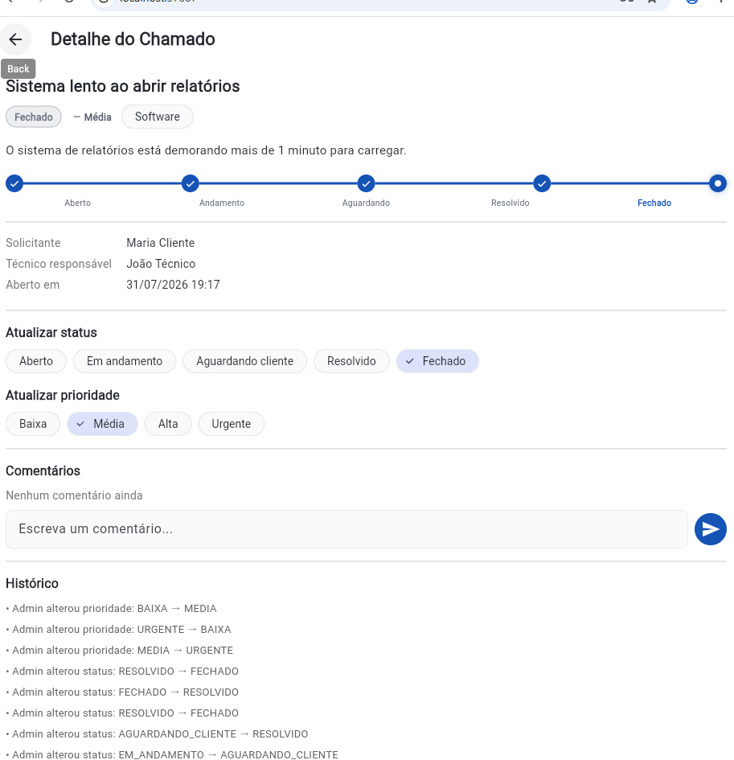
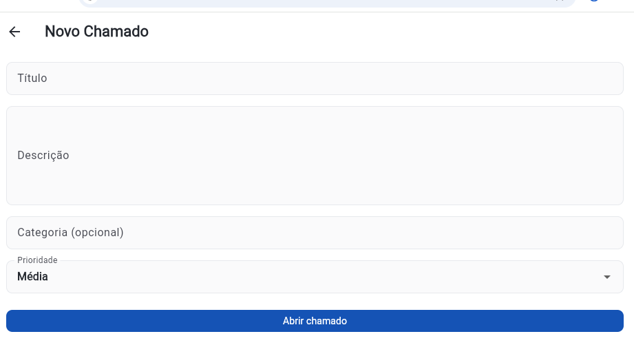

# SEDCON Support Ticket System (Sistema de Chamados)

Technical support ticket system for SEDCON/PROCON-RJ: ticket creation, status updates, priority assignment, technician assignment, and audit history.

Built with the **Node.js + Flutter** stack, aligned with the Junior Full Stack Developer position (Node.js + Flutter).

## Access here

https://sistema-de-chamados-sedcon.netlify.app

Users

| Profile  | E-mail                | Password |
|---------|------------------------|----------|
| Cliente | cliente@chamados.com   | 123456   |
| Técnico | tecnico@chamados.com   | 123456   |
| Admin   | admin@chamados.com     | 123456   |

## Screenshots

| Login | Ticket list |
|---|---|
|  |  |

| Ticket detail (status, priority, comments, and history) | New ticket |
|---|---|
|  |  |

## Stack

- **Back-end**: Node.js, TypeScript, Express, Prisma ORM, PostgreSQL, JWT, Zod
- **Mobile**: Flutter (Dart), Provider, http, flutter_secure_storage

## Structure

```
projeto-chamados/
  backend/       # API REST (Node.js + TypeScript + Prisma + PostgreSQL)
  flutter_app/   # App mobile (Flutter) que consome a API
```

## How to run the full project

1. **Backend**: follow `backend/README.md` (Docker Compose brings up PostgreSQL, then `npm install`, migrations, and seed)
2. **Flutter**: follow `flutter_app/README.md` (point to the API URL and run `flutter run`)

## Main features

- Authentication with JWT and 3 roles: `ADMIN`, `TECNICO`, `CLIENTE`
- Full ticket CRUD with filters and pagination
- Status updates (Open → In progress → Awaiting customer → Resolved → Closed)
- Priority definition/change (Low, Medium, High, Urgent)
- Assignment of responsible technician
- Comments per ticket
- **Audit history**: every status/priority/technician change is logged with author and date
- API documentation via Swagger (`/docs`)

## Automated tests

The backend includes integration tests (Jest + Supertest), covering authentication, role-based permissions, and the ticket flow (creation, status/priority updates, and audit history).

To run them (with the test database already configured — see `backend/README.md`):

```bash
cd backend
npm test
```

## Suggested next steps (portfolio enhancements)

- [x] Automated backend tests (Jest + Supertest)
- [ ] Real-time notifications (Socket.io) when a ticket's status changes
- [ ] Backend deployment (Railway/Render) + managed database, and app deployment via TestFlight/Play Console internal track
- [ ] Dashboard screen with ticket counts by status/priority
